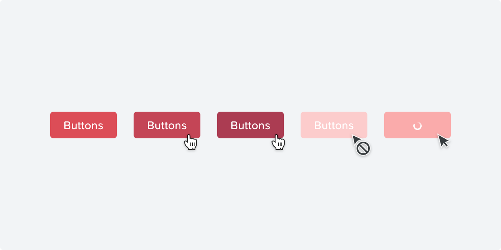

# Buttons

### **Primary button**

### **Secondary button**

### **Link button**

## **Buttons**

Please refer to the Digital Foundations documentation for guidelines on [call to actions ↗](https://digital-foundations.netlify.com/cta/). In addition to those guidelines, the following also apply to buttons in the Plasma system:

#### **General guidelines**

* Text on buttons should always use the Semibold text style.
* Button height is 32px \(in the case of bordered buttons it includes top/bottom 1px\).
* Don't use multiple primary buttons in a single view.

#### **Spacing guidelines**

* Buttons have left/right padding of 15px \(except for link buttons, which have no padding\).
* Buttons contained in narrow spaces \(&gt;150px\) should fill 100% of the width available to them. This helps with cleaner alignment with other elements in that column, and also aligns multiple buttons when stacked.
* If multiple buttons are horizontally aligned, there should be a 20px margin separating them.

#### **Animation**

* There is a subtle fade transition from normal to hover state on buttons.
* transition: all 0.2s;
* Loading animation inside the button corresponds to the loader

#### **Disabled state**

* All button styles follow the same disabled state:
* No background color \(opaque fill\).
* All colors including text, border and any icon are $blackor $white
* Disabled button has an opacity of 10%.

#### **Content**

* An ideal button labeling has a {verb} + {noun} structure. A verb indicates the button is actionable while giving the idea about what to expect.
* Avoid generic labels like “OK”, “Cancel”, “Done” for buttons.

\*\*\*\*

\*\*\*\*

\*\*\*\*

#### **Buttons**

Do

Buttons should be used as the most important actions of the UI, because they have the strongest visual features that are calling a lot of attention.

* Borderless Don’t border-less buttons should not be used on white backgrounds.
  * Idle
  * Hovered
  * Pressed
  * Disabled
  * Loading
* With Icon Primary
  * Idle
  * Hovered
  * Pressed
  * Disabled
  * Add
* With Icon Secondary
  * Idle
  * Hovered
  * Pressed
  * Disabled
* Forward Primary Do Most forward buttons are styled as a primary button since they often indicate the next step of the current UI. However, it’s also acceptable to use them as secondary buttons, where for instance another button has more importance.
  * Idle
  * Hovered
  * Pressed
  * Disabled
* Forward Secondary
  * Idle
  * Hovered
  * Pressed
  * Disabled
* Backward
  * Idle
  * Hovered
  * Pressed
  * Disabled
* With Options
  * Idle
  * Expanded
  * Expanded & Help
  * Expanded & Help Expanded
* Splitted
  * Idle
  * Hovered Default
  * Hovered Alternative
  * Expande
* 
