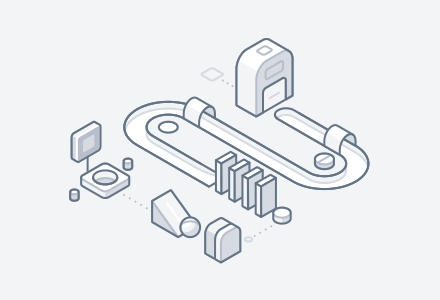

# Animation

### Overview

This illustration system was first conceptualized as a means to enrich the user experience and inject character in to the Prism platform. Though it has since grown beyond its initial purpose, the same ethos that was at the core of our initial developments- to form a flexible, intertwined system for creating illustrations with an emphasis on abstraction that encourages creative use of detail- continues to run throughout our work.

The guidelines below aim to adhere to this initial goal, while offering a platform that supports flexibility and scalability.\

|  |  |
| :--- | :--- |
|   | Motion shows spatial and hierarchical relationships between elements, which actions are available, and what will happen if an action is taken. |
|  | Motion focuses attention on what's important without creating unnecessary distraction. |
|  | Motion celebrates moments in user journeys, adds character to common interactions, and expresses a brand’s personality and style. |

