# Illustration

### Overview

The Nutanix illustration system was first conceptualized as a means to enrich the user experience and inject character in to the Prism platform. Though it has since grown beyond its initial purpose, the same ethos that was at the core of our initial developments- to form a flexible, intertwined system for creating illustrations with an emphasis on abstraction that encourages creative use of detail- continues to run throughout our work.

The guidelines below aim to adhere to this initial goal, while offering a platform that supports flexibility and scalability.

### 

### Sizing

These sizes are for the containers of each illustration. Though the illustrations should be as close to the container size as possible, it is by no means a necessity.

| Width | Height | Type | Application |
| :--- | :--- | :--- | :--- |
| **900px** | **600px** | Extra Large | `Full Page` |
| **440px** | **300px** | Large | `On-boarding` `Popup`   |
| **128px** | **128px** | Square | `Empty State` `Multistep On-boarding` `Marketing Icon` |
| **64px** | **64px** | Widget | `Widget` |

For additional detail regarding sizing, please see the [_**Implementation**_](https://docs.ntnx.design/guides/illustration#implementation) section below and the [_**Resources**_](https://nutanix.design/illustrations-library/#/resources) _****_page of the Illustration Library.

### 

### Color

From a product standpoint, the color palette is a continuation of that used in the Nutanix design system's [_**Color**_](../primitives/colors/) page. We felt that it was important to provide the opportunity to explore a spectrum of colors diverse enough to apply to a myriad of circumstances, while staying true to the tones most commonly seen within the user interface. With this in mind, the fills were chosen to complement- rather than distract- the accompanying design language.

<table>
  <thead>
    <tr>
      <th style="text-align:left"></th>
      <th style="text-align:left"></th>
    </tr>
  </thead>
  <tbody>
    <tr>
      <td style="text-align:left">
        
For product illustrations, never use colors beyond this palette, or alter
          the opacity of fills / strokes. The second and third row are used for motion
          lines and floor guides, with the top being the primary stroke color.

        

        
The product Illustration swatch can be downloaded in the Illustration
          Library&apos;s <a href="https://nutanix.design/illustrations-library/#/resources"><em><b>Resources</b></em></a><em><b> </b></em> section.

      </td>
      <td style="text-align:left">
        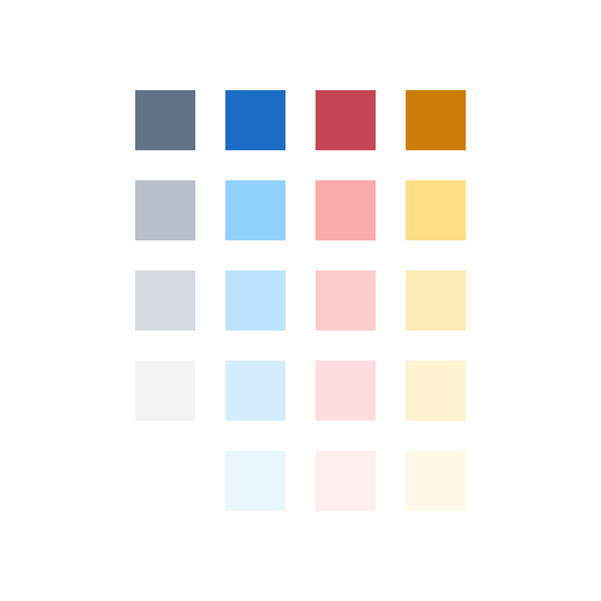
      </td>
    </tr>
    <tr>
      <td style="text-align:left">
        
For marketing illustrations, never use colors beyond this palette, or
          alter the opacity of fills / strokes. Due to the smaller range offered,
          there is greater leeway in how these swatches are implemented, though the
          top row must remain as the color for the outermost stroke of any object.

        

        
The marketing Illustration swatch can be downloaded in the Illustration
          Library&apos;s <a href="https://nutanix.design/illustrations-library/#/resources"><em><b>Resources</b></em></a><em><b> </b></em> section.

      </td>
      <td style="text-align:left">
        
      </td>
    </tr>
    <tr>
      <td style="text-align:left">Highlight areas of interest within an illustration using a non-grey shade.
        For marketing, use a green to place emphasis on the pertinent aspect of
        the illustration.</td>
      <td style="text-align:left">
        
      </td>
    </tr>
    <tr>
      <td style="text-align:left">Only use one set of shades for a color per core component.</td>
      <td style="text-align:left">
        
      </td>
    </tr>
  </tbody>
</table>

 

### **Construction**

The choice of orthographic \(isometric\) projection for our illustrations came as a result of reflecting upon what we feel the Nutanix platform is, who our core audience are and how to best augment the existing design infrastructure. By utilizing this more methodical approach to illustration, we feel there is greater opportunity to visualize what are often abstract concepts, whilst maintaining a visual reflection of our customer’s requirement for a professional, streamlined service. 

<table>
  <thead>
    <tr>
      <th style="text-align:left"></th>
      <th style="text-align:left"></th>
    </tr>
  </thead>
  <tbody>
    <tr>
      <td style="text-align:left">Adhere to the idea of all objects being aligned to an isometric grid;
        all objects should be facing at an increment of thirty degrees.</td>
      <td
      style="text-align:left">
        
        </td>
    </tr>
    <tr>
      <td style="text-align:left">
        
Be sure to define the ground plane if creating an illustration with multiple
          objects.

        

      </td>
      <td style="text-align:left">
        
      </td>
    </tr>
    <tr>
      <td style="text-align:left">
        
If two objects of different colors are touching, the top and / or front
          object&#x2019;s stroke must be visible.

        

      </td>
      <td style="text-align:left">
        
      </td>
    </tr>
    <tr>
      <td style="text-align:left">
        
Use angles of 30 degree increments if showing the motion of two objects
          being connected.

        

      </td>
      <td style="text-align:left">
        
      </td>
    </tr>
    <tr>
      <td style="text-align:left">Align any connecting lines or associated objects to the center edge of
        the object.</td>
      <td style="text-align:left">
        
      </td>
    </tr>
    <tr>
      <td style="text-align:left">Leave a minimum spacing of four pixels between objects or lines on the
        same plane.</td>
      <td style="text-align:left">
        
      </td>
    </tr>
    <tr>
      <td style="text-align:left">Exaggerate proportions of objects in smaller illustrations to improve
        visibility.</td>
      <td style="text-align:left">
        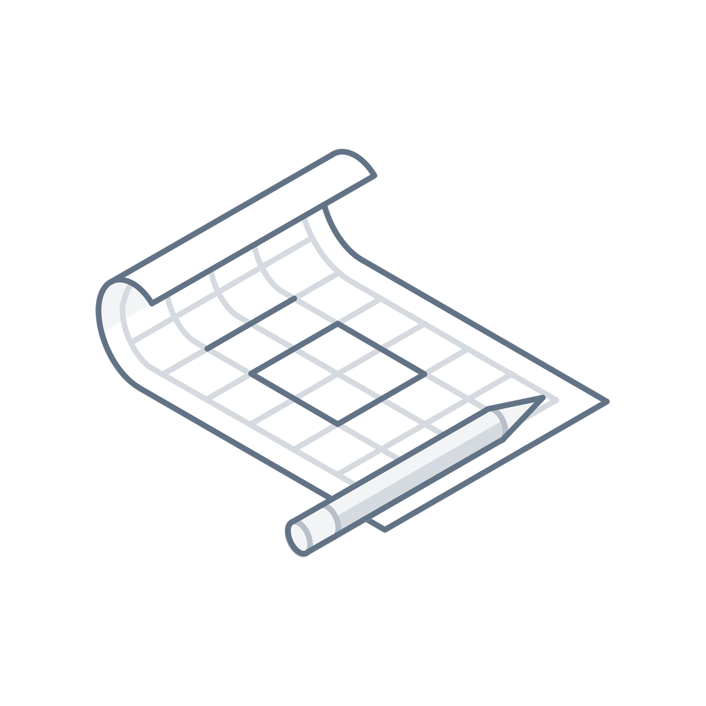
      </td>
    </tr>
    <tr>
      <td style="text-align:left">Simplify elements of objects that may create visual clutter even if untrue
        to actual form.</td>
      <td style="text-align:left">
        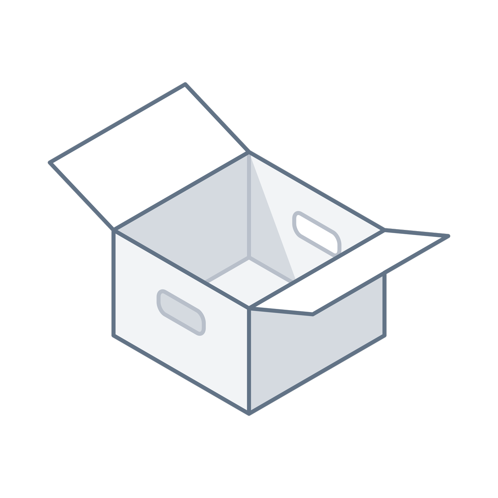
      </td>
    </tr>
  </tbody>
</table>

### **Stroke**

The decision to use outlines \(strokes\) for our illustrations ultimately came down to visibility and in order to promote abstraction. By utilizing a 2 pixel stroke, it encourages the illustrator to shy away from creating unnecessary detail solely through pixel count and instead support creativity through conceptualizing what can often be incredibly abstract concepts.

<table>
  <thead>
    <tr>
      <th style="text-align:left"></th>
      <th style="text-align:left"></th>
    </tr>
  </thead>
  <tbody>
    <tr>
      <td style="text-align:left">
        
Use lighter strokes to add detail within objects where appropriate.

        

      </td>
      <td style="text-align:left">
        

        

          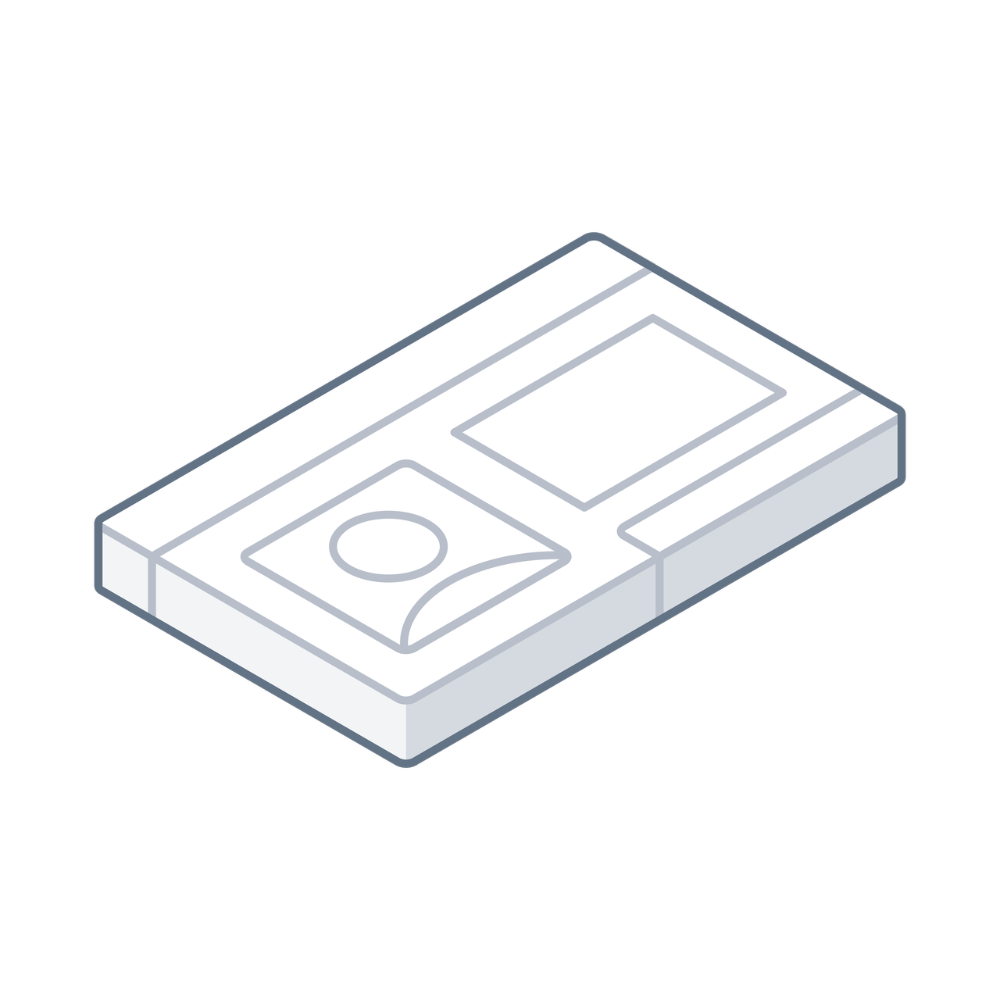
        

      </td>
    </tr>
    <tr>
      <td style="text-align:left">Use a dash of 0 pixels and spacing of 6 pixels when creating lines portraying
        motion or the flow of information.</td>
      <td style="text-align:left">
        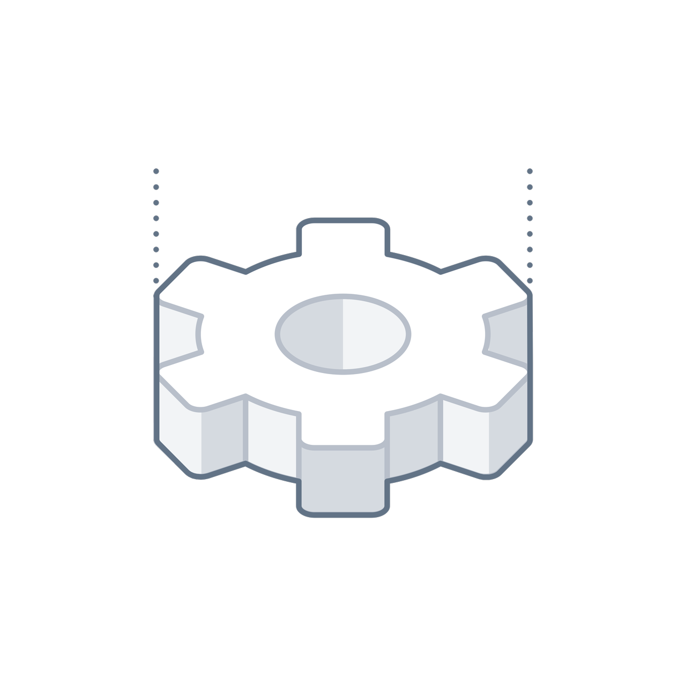
      </td>
    </tr>
    <tr>
      <td style="text-align:left">For strokes on the floor plane, use lighter shades; with dashed lines
        being a shade darker than solid lines. These equate to the second and third
        rows of the palette.</td>
      <td style="text-align:left">
        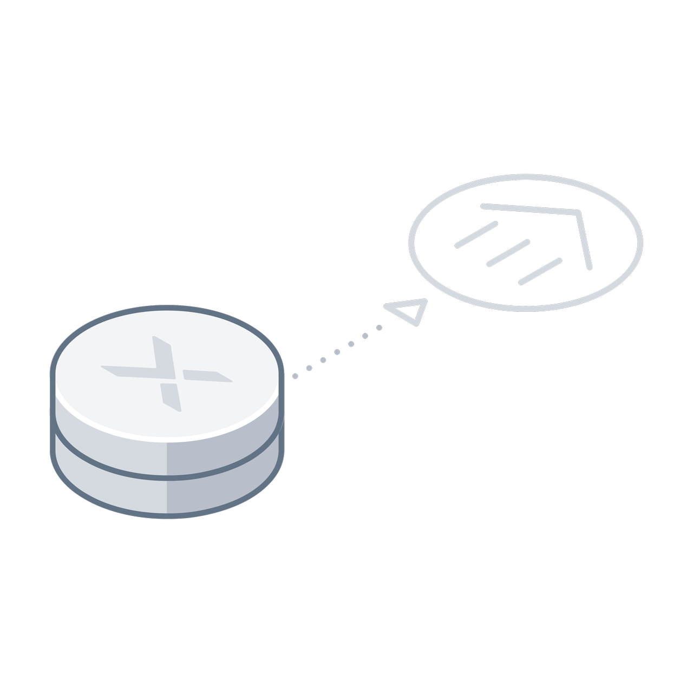
      </td>
    </tr>
    <tr>
      <td style="text-align:left">Avoid harsh edges for connecting vertices or for separating surfaces of
        softer objects.</td>
      <td style="text-align:left">
        
      </td>
    </tr>
    <tr>
      <td style="text-align:left">Use lighter shades when connecting objects or alluding to a form of assembly
        / structure.</td>
      <td style="text-align:left">
        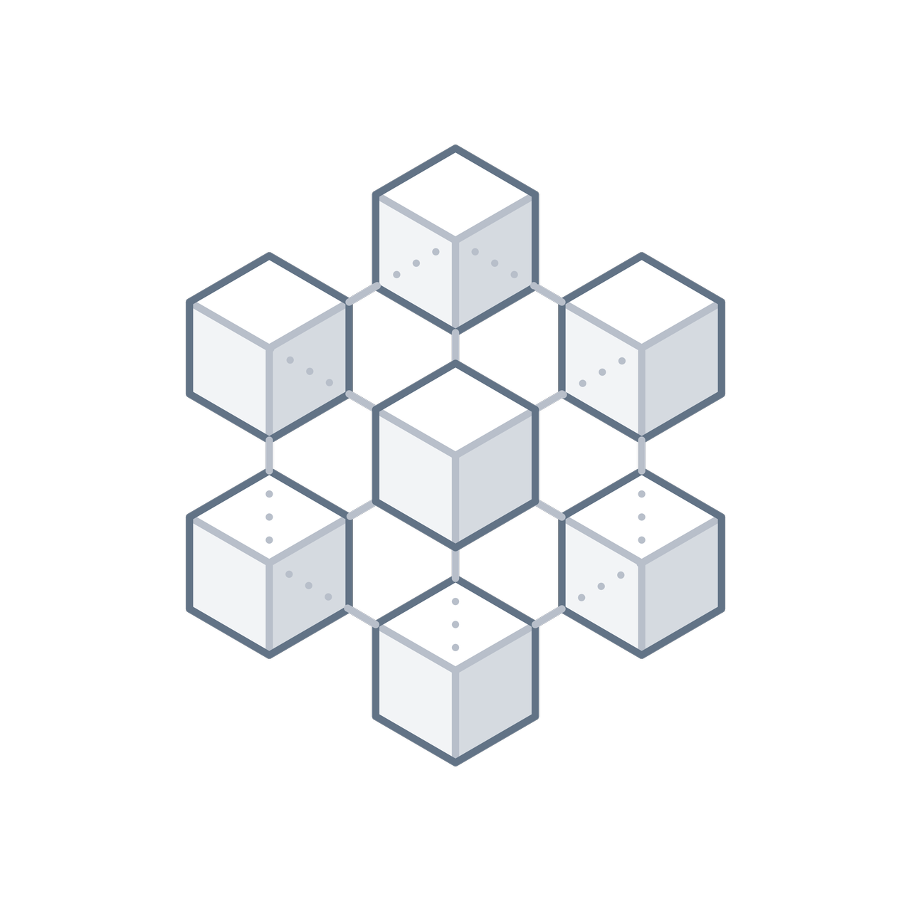
      </td>
    </tr>
  </tbody>
</table>

### Lighting

In keeping with our choice of palette and use of isometric construction, we felt that the lighting system should reflect our choice to abstract and simplify wherever possible. Although ‘physical’ objects are often portrayed, we are showing them in a relatively conceptual manner, with little detail and few properties that would make them akin to their true real-world form.

<table>
  <thead>
    <tr>
      <th style="text-align:left"></th>
      <th style="text-align:left"></th>
    </tr>
  </thead>
  <tbody>
    <tr>
      <td style="text-align:left">
        
Adhere to the concept of a uniform single light source hitting all objects
          at the angle shown.

        

      </td>
      <td style="text-align:left">
        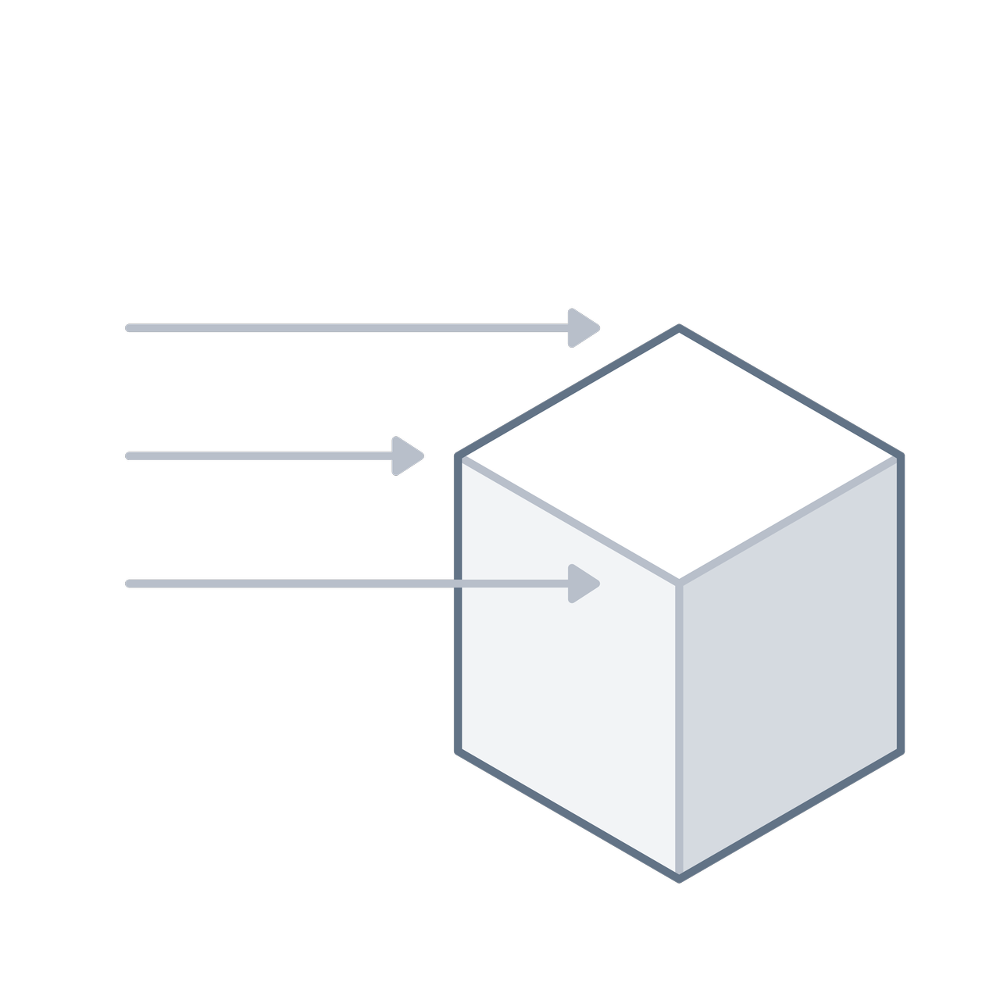
      </td>
    </tr>
    <tr>
      <td style="text-align:left">Use an alternate shade to show the lighting of a curved object. If this
        curvature is uniform, the shift in tone will occur at the center point
        of the object.</td>
      <td style="text-align:left">
        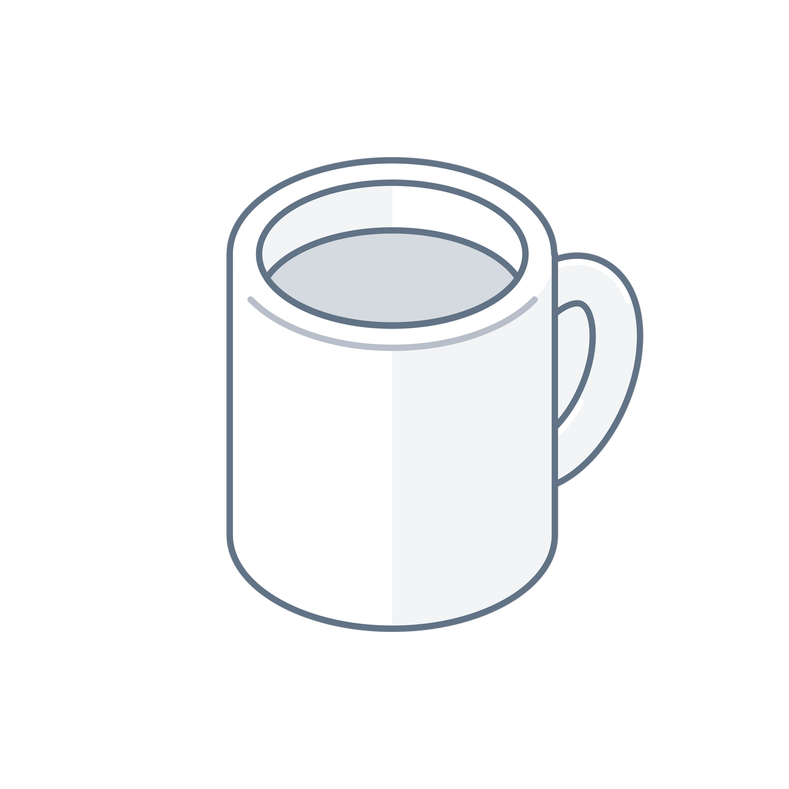
      </td>
    </tr>
    <tr>
      <td style="text-align:left">
        
Only cast shadows within objects if needed; never on to the ground or
          on to other objects.

        

      </td>
      <td style="text-align:left">
        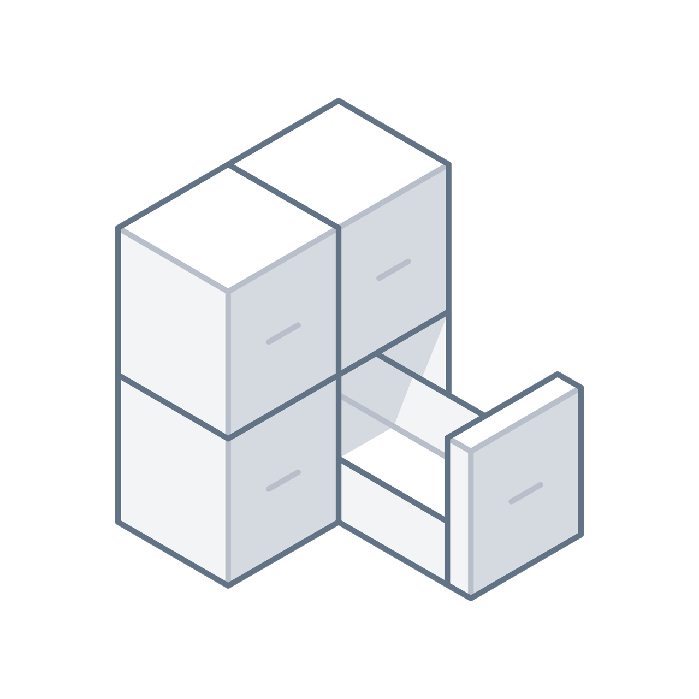
      </td>
    </tr>
    <tr>
      <td style="text-align:left">Choose lighter shades for strokes when showing edges of an object through
        a transparent surface. Do not alter opacity.</td>
      <td style="text-align:left">
        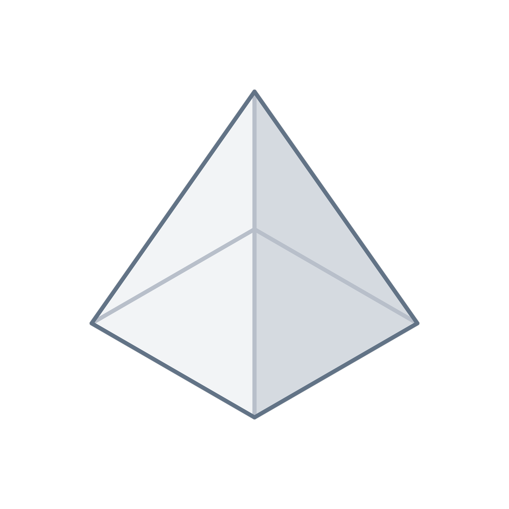
      </td>
    </tr>
    <tr>
      <td style="text-align:left">Rounded reflective materials should show a simple, bold specular highlight.
        Rounded transparent materials should use a lighter shade for inner edgers(as
        above) with an appropriate gap between two different edge shades.</td>
      <td
      style="text-align:left">
        
        </td>
    </tr>
  </tbody>
</table>

### 

### Scaling

Uniformity and consistency can often be an issue when creating illustrations across a platform as vast and diverse as that of Nutanix. These illustrations can appear on screens ranging from the minute to the mammoth. Though the use of strokes encourages greater thought and care when problem solving, it can lead to some issues with consistency when scaling and positioning both entire illustrations and individual objects.

  
With this in mind, set sizing guidelines have been created to prevent any problems that may arise from resizing images after their creation. 

<table>
  <thead>
    <tr>
      <th style="text-align:left"></th>
      <th style="text-align:left"></th>
    </tr>
  </thead>
  <tbody>
    <tr>
      <td style="text-align:left">
        
Maintain a 2 pixel stroke when scaling objects. Simultaneously, be sure
          that no single object in a scene is smaller than 12px x 12px or larger
          than 400 px x 400px.

        

        

      </td>
      <td style="text-align:left">
        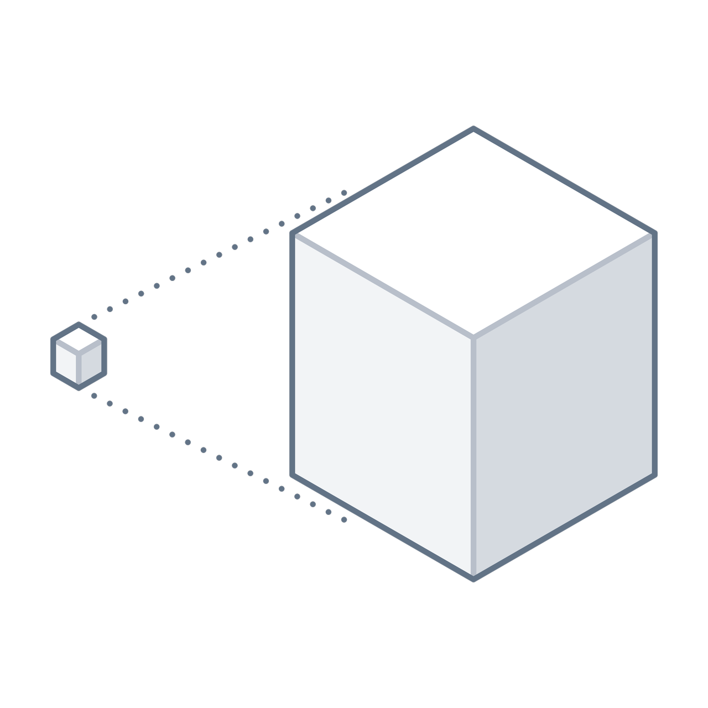
      </td>
    </tr>
    <tr>
      <td style="text-align:left">For complex scenes involving small objects, shading and detail should
        be limited to reduce visual clutter.</td>
      <td style="text-align:left">
        
      </td>
    </tr>
  </tbody>
</table>

### Implementation

Implementing illustrations can be tricky, given the number of elements and stakeholders involved. Much like visual design, consistency and simplicity in their contextualization is key to their success. For detailed examples of illustration implementation, visit the [_**Resources**_](https://nutanix.design/illustrations-library/#/resources) _****_ section of the Nutanix Illustration Library.

|  |  |
| :--- | :--- |
| Be mindful of spacing and padding between illustrations, text, and buttons. As a general rule of thumb, work in 10 pixel increments starting at a minimum of 20 pixels between an illustration and other object. |  |
| Be sure to check illustrations when exporting. Although .svg's are preferential, be wary of potential warping and incorrect layer ordering; particularly if expanding before export. |  |

### Requesting a new illustration

1. Go to [https://jira.nutanix.com](https://jira.nutanix.com) and create a ticket under **Global Design Ops \(DESIGN\),** then select UX/UI Story as an issue type. 
2. In the EPIC link select **EPIC: Illustration Design System** .

